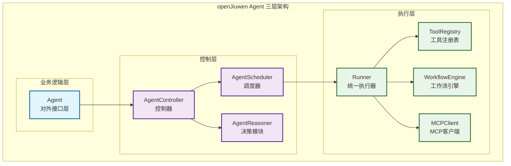
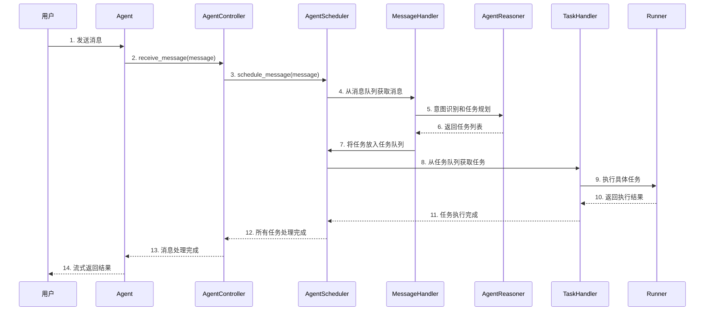
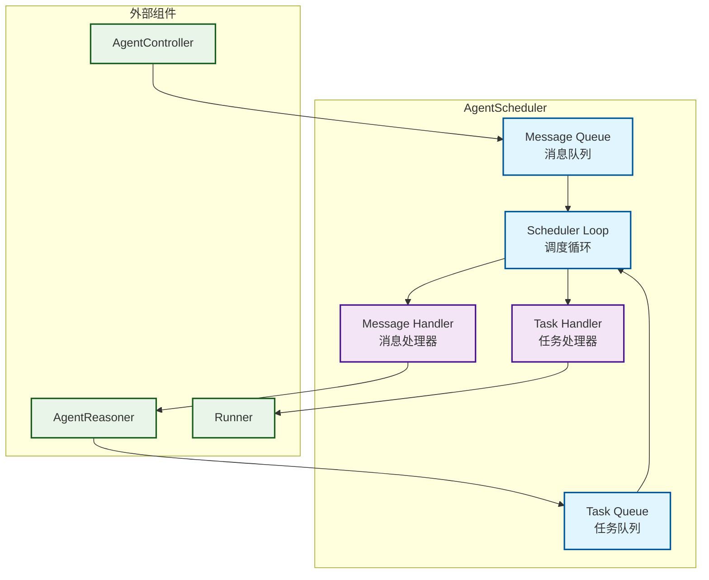
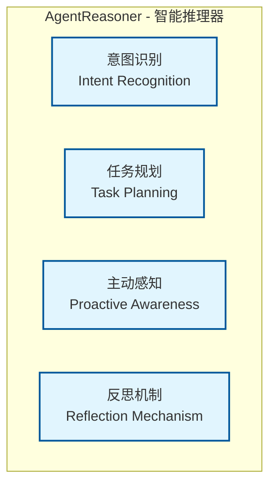
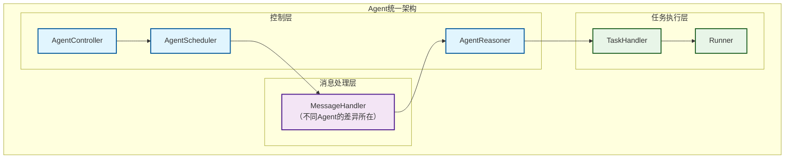

# 基于openJiuwen框架的Agent开发

## 引言

在人工智能快速发展的今天，Agent系统已经从简单的单任务执行器进化为复杂的多Agent协作系统。传统的同步调用模式在面对复杂业务场景时显得力不从心，而openJiuwen框架基于事件驱动架构（Event-Driven Architecture, EDA）为我们提供了一种全新的解决方案。

openJiuwen框架是一个专为智能Agent开发设计的现代化框架，它融合了EDA架构的优势，提供了完整的Agent开发生态。本文将深入探讨基于openJiuwen框架的Agent开发理念，从单Agent的设计哲学开始，逐步揭示如何构建可扩展、高性能的智能Agent系统。

## openJiuwen框架的核心设计理念

### 事件驱动的本质

传统Agent开发往往采用同步调用模式：用户请求 → Agent处理 → 返回结果。这种方式在处理简单任务时表现良好，但在面对复杂业务场景时暴露出诸多问题：

- **阻塞性**：一个Agent的长时间处理会阻塞整个系统
- **扩展性差**：难以支持多Agent协作
- **智能规划能力弱**：缺乏统一的智能规划机制

openJiuwen框架通过**事件驱动**的方式彻底改变了这一局面。在openJiuwen框架中，Agent不再是被动的服务提供者，而是主动的事件响应者。每个Agent都具备：

- **事件感知能力**：能够监听和响应特定类型的事件
- **异步处理能力**：支持非阻塞的事件处理
- **智能规划能力**：通过意图识别引擎、任务规划引擎、主动规划引擎三位一体，实现高精度意图识别、智能任务分解和前瞻性任务准备

### Agent的核心智能组件

openJiuwen框架中的Agent具备两个核心智能组件，它们共同构成了Agent的"大脑"和"心脏"：

#### AgentScheduler：智能调度器

AgentScheduler是Agent的"心脏"，负责管理消息队列和任务队列，实现统一的调度循环。它通过简洁的数据结构设计，消除复杂的调度逻辑，实现高效的任务调度：

- **消息队列管理**：确保消息的有序处理，支持消息的入队和出队操作
- **任务队列管理**：管理Agent的任务队列，支持任务的调度和执行
- **调度循环实现**：持续监控消息队列和任务队列的状态，协调消息处理和任务执行

#### AgentReasoner：智能推理器

AgentReasoner是Agent的"大脑"，负责将原始消息转换为可执行的任务规划。它通过消除特殊情况，将复杂的意图识别和任务规划统一为简洁的决策流程：

- **意图识别**：理解用户请求的深层意图，结合历史对话和当前状态进行意图分析
- **任务规划**：将复杂任务分解为可执行的子任务，支持动态调整和优化
- **主动感知**：识别需要主动处理的事件，如定时任务和状态变化
- **反思机制**：从执行结果中学习，持续优化决策能力

## openJiuwen框架中的单Agent架构设计

### Agent的三层架构

在openJiuwen框架中，每个Agent都采用三层架构设计：

#### 1. 业务逻辑层（Agent）

这是Agent的对外接口层，负责：

- 接收外部调用
- 管理Agent的生命周期
- 提供统一的执行接口

Agent本身不包含复杂的业务逻辑，而是将具体的处理委托给内部的控制器。

#### 2. 控制层（AgentController）

控制层是Agent的核心，包含两个关键组件：

**调度器（AgentScheduler）**：

- 管理消息队列和任务队列
- 实现统一的调度循环
- 处理消息和任务的优先级

**决策模块（AgentReasoner）**：

- 意图识别：理解用户请求的真实意图
- 任务规划：将复杂任务分解为可执行的子任务
- 主动感知：识别需要主动处理的事件
- 反思机制：从执行结果中学习和优化

#### 3. 执行层（Runner）

执行层负责具体的任务执行，支持三种执行模式：

**工具调用执行器**：

- 从工具注册表获取工具实例
- 执行工具调用并处理结果
- 支持工具调用的超时和重试

**工作流执行器**：

- 管理工作流的生命周期
- 处理步骤间的依赖关系
- 支持工作流的暂停和恢复

**MCP工具执行器**：

- 管理MCP服务器连接
- 处理MCP协议通信
- 支持MCP工具的动态发现

### 消息处理的生命周期

在openJiuwen框架中，消息处理遵循严格的生命周期：

这个生命周期确保了消息处理的**可预测性**和**可观测性**。

### Agent创建流程

在openJiuwen框架中，Agent的创建遵循简洁的配置驱动模式：

1. **配置定义**：通过AgentConfig定义Agent的基本属性，包括ID、类型、支持的任务类型等
2. **实例创建**：基于配置创建Agent实例
3. **生命周期管理**：通过start()和stop()方法管理Agent的生命周期
4. **流式调用**：使用Runner进行流式调用，支持实时输出

这种设计确保了Agent创建的简洁性和一致性，开发者只需关注业务逻辑，无需关心底层的实现细节。

## openJiuwen框架的AgentScheduler：智能调度器

### AgentScheduler的设计哲学

AgentScheduler是每个Agent中的"心脏"，负责管理消息队列和任务队列，实现统一的调度循环。它通过简洁的数据结构设计，消除复杂的调度逻辑，实现高效的任务调度。

### AgentScheduler的核心功能

#### 1. 消息队列管理

AgentScheduler负责管理Agent的消息队列，确保消息的有序处理：

- **消息入队**：支持消息的入队操作
- **消息出队**：按顺序处理消息，保证处理效率
- **队列管理**：维护消息队列的状态

#### 2. 任务队列管理

管理Agent的任务队列，支持任务的调度和执行：

- **任务入队**：将生成的任务放入任务队列
- **任务出队**：按顺序执行任务
- **队列管理**：维护任务队列的状态

#### 3. 调度循环实现

实现统一的调度循环，协调消息处理和任务执行：

- **循环调度**：持续监控消息队列和任务队列的状态
- **消息处理**：优先处理消息队列，生成任务
- **任务执行**：处理任务队列，执行具体任务
- **异常处理**：统一的异常处理机制，确保调度器的稳定性

### AgentScheduler的架构图

## openJiuwen框架的规划能力增强：AgentReasoner模块

### AgentReasoner的设计哲学

在openJiuwen框架中，AgentReasoner是Agent的"大脑"，负责将原始消息转换为可执行的任务规划。它通过消除特殊情况，将复杂的意图识别和任务规划统一为简洁的决策流程。

### AgentReasoner的核心能力

#### 1. 意图识别（Intent Detection）

AgentReasoner能够理解用户请求的深层意图，而不仅仅是表面的关键词匹配：

- **模式匹配**：通过预定义的意图模式识别用户意图
- **上下文感知**：结合历史对话和当前状态进行意图分析
- **统一处理**：通过数据结构设计消除复杂的条件分支
- **动态学习**：从用户交互中持续学习和优化意图识别

#### 2. 任务规划（Task Planning）

将复杂任务分解为可执行的子任务，支持动态调整和优化：

- **任务分类**：根据意图识别任务类型和复杂度
- **步骤生成**：将复杂任务分解为可执行的步骤序列
- **顺序优化**：优化执行顺序，提高任务执行效率
- **动态调整**：根据执行结果动态调整后续任务

#### 3. 主动感知（Proactive Awareness）

AgentReasoner不仅响应外部请求，还能主动识别需要处理的事件：

- **定时任务检查**：识别需要触发的定时任务
- **状态变化监控**：监控系统状态变化，主动响应
- **事件优先级**：为不同事件分配优先级
- **智能触发**：根据业务规则智能触发相应处理

#### 4. 反思机制（Reflection Mechanism）

从执行结果中学习，持续优化决策能力：

- **效率分析**：分析任务执行的效率和质量
- **改进识别**：识别执行过程中的改进点
- **模型更新**：基于反思结果更新决策模型
- **持续优化**：通过反思机制实现决策能力的持续提升

### AgentReasoner的四大核心模块

AgentReasoner由四个核心模块组成，每个模块负责特定的智能决策功能：

## openJiuwen框架中的常见Agent范式实现

在openJiuwen框架中，不同Agent类型的核心差异在于**MessageHandler中的实现策略**。MessageHandler根据不同的Agent策略输出不同类型的任务，从而实现了不同Agent范式的支持。

### ReAct Agent实现

#### ReAct模式的核心思想

ReAct（Reasoning + Acting）模式强调Agent应该具备**推理**和**行动**的双重能力。在openJiuwen框架中，ReAct Agent的MessageHandler会输出**工具调用**和**MCP调用**任务。

#### ReAct Agent的任务输出策略

ReAct Agent的MessageHandler根据用户意图和上下文，会生成以下类型的任务：

- **工具调用任务**：调用注册的工具函数
- **MCP调用任务**：调用MCP服务器提供的工具
- **推理任务**：进行思考和分析的任务

### Workflow Agent实现

#### 工作流的本质

Workflow Agent专门处理预定义的多步骤、有依赖关系的工作流任务。与ReAct Agent不同，Workflow Agent的MessageHandler主要输出**工作流调用**任务。

#### Workflow Agent的任务输出策略

Workflow Agent的MessageHandler根据用户请求，会生成：

- **工作流启动任务**：启动特定的工作流实例
- **工作流控制任务**：管理工作流的执行状态

### Agent范式的统一架构

无论是ReAct Agent还是Workflow Agent，它们都遵循相同的三层架构，差异仅在于MessageHandler中的任务生成策略：

### 不同Agent范式的实现差异

| Agent类型 | MessageHandler输出任务类型 | 主要特点 |
|-----------|---------------------------|----------|
| ReAct Agent | 工具调用、MCP调用、推理任务 | 强调推理和行动的循环 |
| Workflow Agent | 工作流启动、步骤执行、流程控制 | 注重流程控制和状态管理 |
| Chat Agent | 对话生成、上下文管理 | 专注于对话交互 |
| Custom Agent | 自定义任务类型 | 根据业务需求定制 |

通过这种设计，openJiuwen框架实现了Agent范式的统一管理，开发者可以根据业务需求选择合适的Agent类型，而无需关心底层的实现细节。

## 总结

openJiuwen框架为Agent开发带来了全新的设计理念和实现方式。通过事件驱动、异步处理、智能规划等核心机制，我们能够构建出更加智能、高效、可扩展的Agent系统。

在下一篇文章中，我们将探讨openJiuwen框架中多Agent协作的设计理念，包括AgentGroup、消息路由、Handoff机制等高级主题。通过多Agent协作，我们能够构建出更加复杂和强大的智能系统。

---

*本文基于openJiuwen框架的设计理念，为开发者提供了单Agent开发的完整指南。在实际应用中，开发者可以根据具体业务需求选择合适的架构模式和实现策略。*